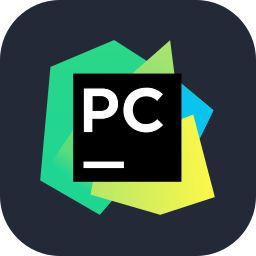

<h1 align="center">Hi 👋, I'm Anol Dsouza</h1>
<h3 align="center">💻 Software Engineer</h3>

---

## 👨‍💻 Who Am I

- 🎓 Software Engineer  
- 💡 Passionate about building real-world applications  
- 📱 Interested in Full Stack Development  
- 🚀 Currently improving my development skills  

---

## 🛠️ Tools & Technologies

  
  
  
  
  
  
  
  
  

---

## 🚀 Projects

### 🏋️ FitGenie
- AI-powered fitness & wellness mobile app  
- Includes workout tracking and AI chatbot  

---

### 🍜 China Metro Restaurant
- Full-stack restaurant website  
- Features login system, menu, and admin panel  

---

## 🔮 Currently Working On

- 📱 Improving FitGenie app  
- 🌐 Building more full-stack projects with AI  
- ⚡ Learning advanced backend & APIs  

---

---

⭐️ From Anol Dsouza
